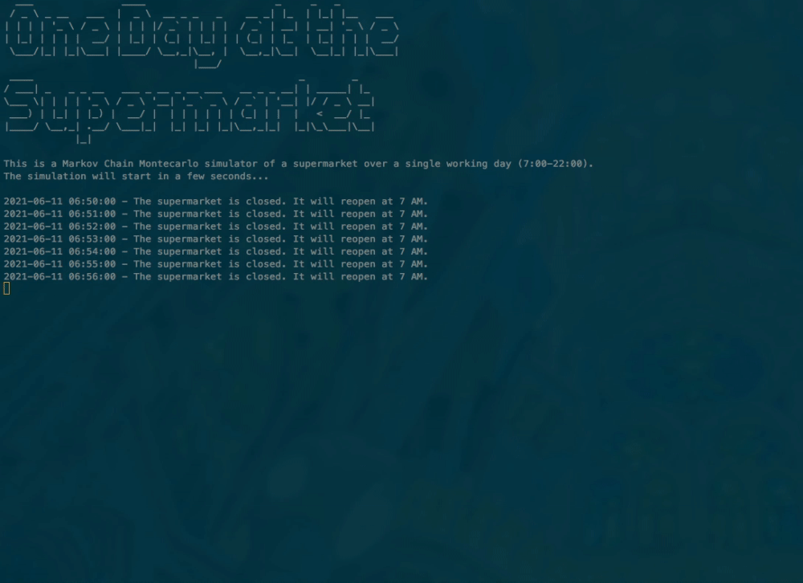

# Supermarket Markov Chains Monte Carlo Simulation 
The Project runs a Monte Carlo simulation to predict the customers' behavior in a hypothetical supermarket with below layout:

## Repo Structure

### 1. MCMC Simulation
- For the calculation of the transition matrix -> proba.py
- For the executable script that runs the simulation -> supermarket.py
- For an old-fashioned videogame-like visualization of the Monte Carlo Simulation -> visualization.py
- For checking the simulation output data -> output folder

### 2. Notebooks
- For exploratory data analysis -> EDA.ipynb
- For summary on Markov-Chains theory -> theory.ipynb

### 3. Data
- For the raw daily supermarket data that form the dataset of this model (in csv format) -> data
- For cleaned up data as created by EDA.ipynb, and ready for calucating transition matrix -> data/cleaned-up

